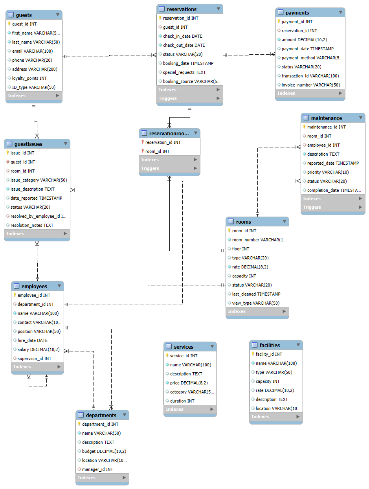
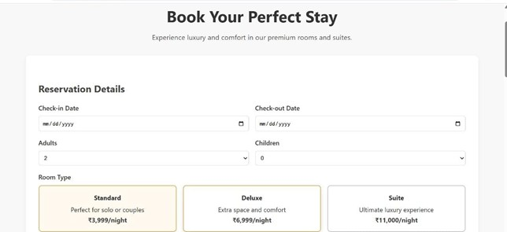
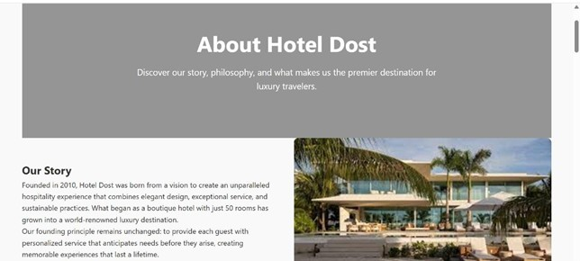
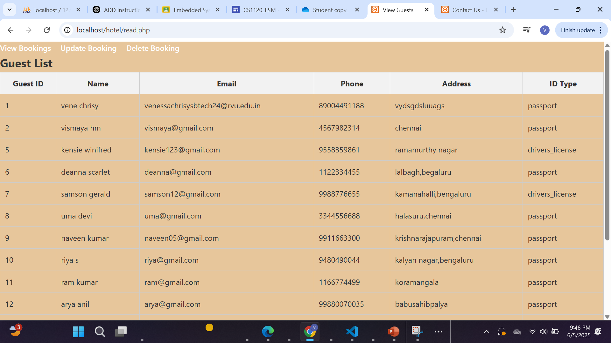
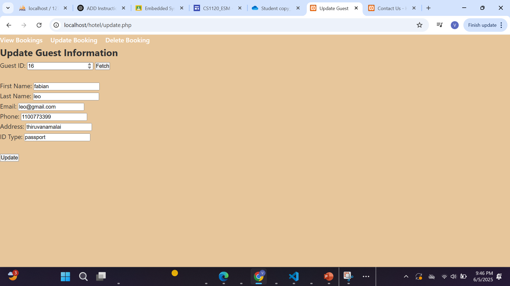
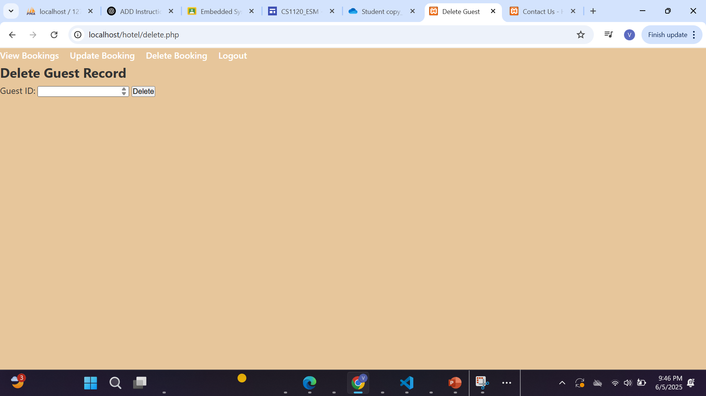

# Hotel Dost — Hotel Booking Management System

Hotel Dost is a **web-based hotel booking platform** developed as part of the **Database Management Systems (DBMS) course project**.  
The system allows users to book hotel rooms, manage reservations, and store guest details using a **MySQL database with PHP backend integration**.

---

## 📌 Project Overview

The goal of this project is to demonstrate how a **frontend web interface integrates with a backend database system** to perform operations such as:

- Booking hotel rooms
- Managing guest information
- Handling reservations
- Processing payments
- Performing CRUD operations on database records

The project implements **full CRUD functionality** using **PHP and MySQL**.

---

## 🛠️ Technologies Used

**Frontend**
- HTML
- CSS
- JavaScript

**Backend**
- PHP

**Database**
- MySQL

**Tools**
- VS Code
- XAMPP
- MySQL Workbench

---

## 🗄️ Database Design (ER Diagram)

The database structure was designed using an **Entity Relationship (ER) model**.

The system includes the following main tables:

- Guests
- Reservations
- ReservationRooms
- Payments

---

## 🖥️ Frontend Pages

### Home Page

Provides an overview of the hotel and available services.

---

### Booking Form

Users can enter booking details such as:

- Check-in and check-out dates
- Number of guests
- Room type
- Guest information
- Payment details

---

### Booking Confirmation

Displays confirmation after successful reservation.

---
### About Page

Allows user to know more about the hotel.

### Contact Page

Allows users to contact the hotel for inquiries.

---

## ⚙️ CRUD Operations

The system implements **Create, Read, Update, and Delete operations** on reservation data.

### CREATE (Booking)

Users create new bookings through the reservation form.

---

### READ (View Bookings)

Displays stored booking records from the database.

---

### UPDATE (Modify Booking)

Users can update reservation details such as checkout date or room selection.

---

### DELETE (Cancel Booking)

Users or administrators can delete reservations.

---

## 🔄 System Workflow

Frontend Form  
⬇  
PHP Backend Processing  
⬇  
MySQL Database Query  
⬇  
Database Response  
⬇  
Frontend UI Update

---

## 🚀 Features

- Online hotel room booking
- Guest information management
- Reservation tracking
- Payment information storage
- Full CRUD operations
- Frontend–backend integration

---

## 📚 Learning Outcomes

Through this project we learned:

- Database schema design
- ER diagram modeling
- PHP–MySQL integration
- CRUD operations implementation
- Web application architecture
- Full stack development basics

---

Author-Venessa Chrisy.S
RV University  
B.Tech Computer Science and Engineering  
Database Management Systems Project
